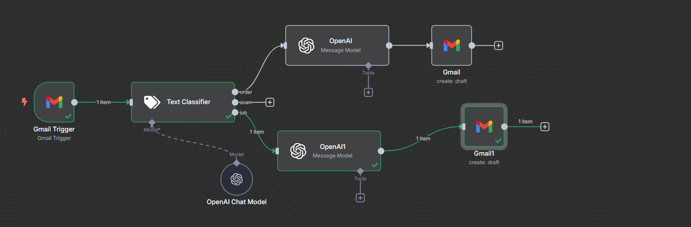

# 📬 Gmail AI Assistant with n8n

This is a smart Gmail automation built with [n8n](https://n8n.io/), OpenAI, and LangChain.  
It **automatically classifies new Gmail messages** and **creates AI-generated draft replies** using GPT-4o-mini.

> 🛠️ This is a basic but functional prototype for automating email response workflows.

---

## 📌 What It Does

- ✅ Listens for **new Gmail messages**
- 🏷 Classifies them as one of:
  - `order`, `scam`, or `job`
- ✍️ Uses OpenAI (GPT-4o-mini) to generate:
  - A subject line
  - A reply body
- 💌 Saves the result as a **Gmail draft**

---

## 🧠 How the Workflow Works

Here’s how each part works step-by-step:

### 🖼 Workflow Diagram

.

---

### 🔄 Step-by-Step Breakdown

1. **Gmail Trigger**
   - Checks for new messages in your Gmail inbox every minute.
   - Passes the message snippet to the next step.

2. **Text Classifier (LangChain)**
   - Categorizes the email as either:
     - `order` → New order notification
     - `scam` → Possible spam/scam
     - `job` → Job-related message

3. **OpenAI Chat Model**
   - Uses the classification result to guide response generation.
   - There are two OpenAI branches:
     - One for `order/scam` emails
     - One for `job` emails
   - Both generate:
     - 📌 A subject line
     - 💬 A full reply body

4. **Gmail Draft Creator**
   - Takes OpenAI's output and creates a **draft reply**.
   - The user can later review and send it manually from Gmail.

---

